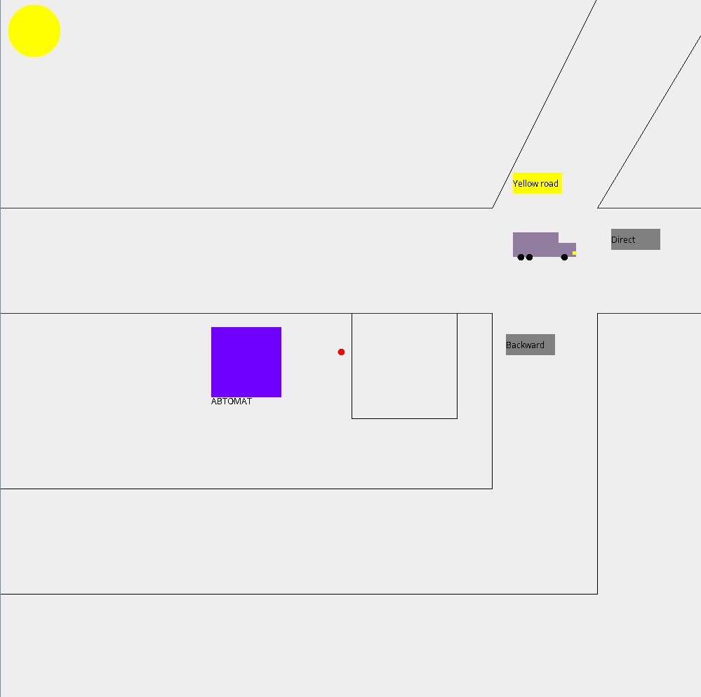

# TA2020_Project

Final project on automata theory.

Реализован автомат робота-регулировщика на перекрестке, где имеют место следующие правила:

- Есть некоторая дорога с перекрестком, постом полиции перед ним и датчиком дня/ночи. По данной дороге машины движутся следующим образом:

- Желтые машины нужно перенаправлять на жёлтую дорогу.

- Ночью чёрные машины перенаправляются назад, т.к. ночью на дороге плохо видно чёрные машины, что аварийно опасно.

- Все красные машины - преступники, поэтому их нужно ловить на посту по одной (на больше машин мест нет), задерживать и ждать, пока не проедет полицейская машина (синяя), захватить её тоже (пока
этого не произошло, остальные машины перенаправляем в обычном порядке, красные в том числе, т.к. место есть только для одной). Сразу после этого место освобождается для следующего преступника.

- Если проезжает оранжевая машина, то следующие две машины перенаправляются назад, причём оранжевая машина забирает с собой красную, если она задержана. Ночью чёрные машины не считаются
ни за одну из двух, когда их разворачивают.

- Остальные машины едут дальше (прямо), ничего делать не нужно.

Сверху слева – датчик дня/ночи (день – желтый круг, ночь – белый), три дороги сверху вниз: желтая (для желтых машин), дорога прямо и дорога вниз для разворота машин. До перекрестка имеет «карман» для задержания машин. Слева от кармана – датчик, показывающий поймана ли красная машина или нет. Большой фиолетовый квадрат – робот-регулировщик.

